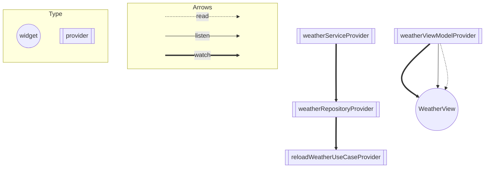

# アーキテクチャ

[riverpod_graph](https://github.com/rrousselGit/riverpod/tree/master/packages/riverpod_graph) を利用して自動生成しました。

## レイヤードアーキテクチャ

Flutter Docsの[Common architecture concepts](https://docs.flutter.dev/app-architecture/concepts)ではレイヤードなアーキテクチャが推奨されています。
また、RiverpodのProviderにおいてBuildContextを扱うことは避けるべきとされています。（参考: [avoid_build_context_in_providers (riverpod_lint)](https://pub.dev/packages/riverpod_lint#avoid_build_context_in_providers-riverpod_generator-only)）

そこで、今回はクリーンアーキテクチャ+MVVMな構成を採用することにしました。
また、ディレクトリ構成はLayer-firstにしました。

### Presentation

- `WeatherView`
    - UI (BuildContext)を扱うような関数はView内に定義している
    - Reloadボタンを押した際に`WeatherViewModel`の`reloadWeather`関数を実行する
- `WeatherViewModel`
    - `reloadWeather`関数が実行されると、`ReloadWeatherUseCase`の`execute`関数を実行する
    - 成功した場合と失敗した場合で状態を更新する

### Application

- `ReloadWeatherUseCase`
    - `WeatherRepository`からデータを取得して結果を`WeatherViewModel`に返す

### Infrastructure

- `WeatherRepository`
    - `WeatherService`から受け取ったデータをResult型に変換する
    - エラーハンドリングを行う
- `WeatherService`
    - `YumemiWeather`からデータを取得し、結果のJSONをMapに変換する

### Domain

- `Result`や`UseCase`、`Entity`を定義している
  - 今までの開発において、[Clean Arhitecture and Riverpod](https://otakoyi.software/blog/flutter-clean-architecture-with-riverpod-and-supabase)の記事を参考にしていることが多いです。
  - そのため、ModelではなくEntityにしています。
