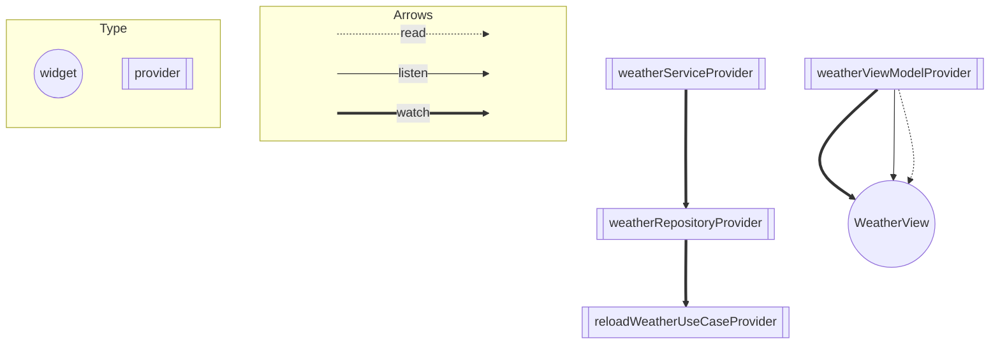

# アーキテクチャ

## クリーンアーキテクチャ

- Flutter Docsの[Common architecture concepts](https://docs.flutter.dev/app-architecture/concepts)ではレイヤードなアーキテクチャが推奨されています
  - → 普段の開発において[Clean Arhitecture and Riverpod](https://otakoyi.software/blog/flutter-clean-architecture-with-riverpod-and-supabase)の記事を参考にしていることが多いため、クリーンアーキテクチャを採用する
- RiverpodのProviderにおいてBuildContextを扱うことは避けるべきとされています（[avoid_build_context_in_providers (riverpod_lint)](https://pub.dev/packages/riverpod_lint#avoid_build_context_in_providers-riverpod_generator-only)）
  - → ModelとViewの中間層でViewとの結合度を小さくするため、MVVMを採用する

よって、今回はクリーンアーキテクチャ+MVVMの構成で開発を行っています。
また、ディレクトリの構成はLayer-firstにしました。

### ディレクトリ構成

下記のようなディレクトリ構成になっています。

```
lib
├── application
│   └── weather
│       ├── usecase_providers.dart
│       ├── usecase_providers.g.dart
│       └── usecases
│           └── reload_weather_usecase.dart
├── config
│   └── gen
│       └── assets.gen.dart
├── domain
│   ├── common
│   │   ├── constants
│   │   │   └── common_error_messages.dart
│   │   └── interfaces
│   │       ├── result.dart
│   │       └── usecase.dart
│   └── weather
│       ├── constants
│       │   ├── weather_condition.dart
│       │   └── weather_error_messages.dart
│       └── entities
│           ├── weather_info_entity.dart
│           ├── weather_info_entity.freezed.dart
│           ├── weather_info_entity.g.dart
│           ├── weather_target_entity.dart
│           ├── weather_target_entity.freezed.dart
│           └── weather_target_entity.g.dart
├── infrastructure
│   └── weather
│       ├── api
│       │   └── weather_service.dart
│       ├── repositories
│       │   └── weather_repository.dart
│       ├── repository_providers.dart
│       ├── repository_providers.g.dart
│       ├── service_providers.dart
│       └── service_providers.g.dart
├── main.dart
└── presentation
    ├── common
    │   └── components
    │       └── error_dialog.dart
    ├── startup
    │   ├── mixins
    │   │   └── on_layout_built_mixin.dart
    │   └── views
    │       └── startup_view.dart
    └── weather
        ├── components
        │   ├── temperature_indicator.dart
        │   └── weather_action_button.dart
        ├── view_models
        │   ├── weather_view_model.dart
        │   └── weather_view_model.g.dart
        ├── view_states
        │   ├── weather_view_state.dart
        │   └── weather_view_state.freezed.dart
        └── views
            └── weather_view.dart
```

[build.yaml](./build.yaml)では、freezed, json_serializable, riverpod_generatorの生成対象を制限しています。
ビルド速度の向上もありますが、自動生成ファイルが乱立してディレクトリ構成が見られるのを防ぐ目的もあります。

### Presentation

- `StartupView`
  - アプリ起動時に開かれ、緑色背景のみの画面を表示する
  - 画面が表示された500ms後に`WeatherView`に遷移する
  - `WeatherView`で戻る操作をした場合、`StartupView`に戻って再度遷移処理が行われる
- `WeatherView`
  - UI (BuildContext)を扱うような関数はView内に定義している
  - Reloadボタンを押した際に`WeatherViewModel`の`reloadWeather`関数を実行する
    - `WeatherViewModel`をwatchし、成功した場合に取得した天気予報をUIに反映する
    - エラーメッセージの有無をlistenし、エラーが発生した場合はエラーダイアログを表示する
- `WeatherViewModel`
  - `reloadWeather`関数が実行されると、`ReloadWeatherUseCase`の`call`関数を実行する
  - 処理結果（成功・失敗）に応じて、天気予報やエラーメッセージなどを更新する
    - 成功時: エラーメッセージを消去し、取得した天気予報でstateを更新する
    - 失敗時: 元の天気予報を保持しながら、エラーメッセージでstateを更新する

### Application

- `ReloadWeatherUseCase`
  - `WeatherRepository`からデータを取得して結果を`WeatherViewModel`に返す

### Infrastructure

- `WeatherRepository`
  - `WeatherService`から受け取ったデータをResult型に変換する
  - エラーハンドリングを行う
- `WeatherService`
  - `YumemiWeather`からデータを取得し、結果のJSONをWeatherInfoEntityに変換する

### Domain

- `Result`や`UseCase`、`Entity`を定義している
  - 今までの開発において、[Clean Arhitecture and Riverpod](https://otakoyi.software/blog/flutter-clean-architecture-with-riverpod-and-supabase)の記事を参考にしていることが多いです。
  - そのため、ModelではなくEntityにしています。

[riverpod_graph](https://github.com/rrousselGit/riverpod/tree/master/packages/riverpod_graph) を利用して自動生成しました。


